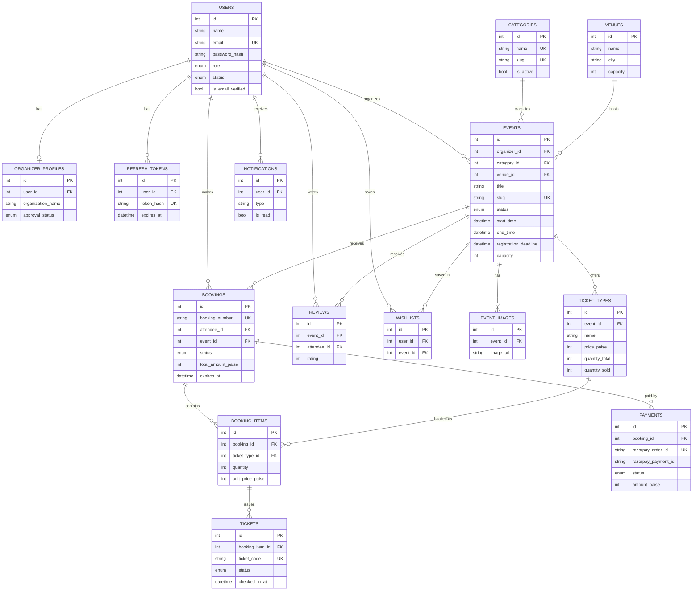

# 03 — Database Design (MySQL + Sequelize)

Conventions:

- Table names `snake_case` plural; Sequelize models `PascalCase` singular (`underscored: true`).
- Primary keys: `id` `INT UNSIGNED AUTO_INCREMENT`. Public identifiers that must not be guessable get an additional unique code (e.g., `booking_number`, `ticket_code`).
- All money columns are **paise, `INT UNSIGNED`** (₹499.00 → `49900`).
- All timestamps `DATETIME` in **UTC**; `created_at`/`updated_at` on every table (Sequelize `timestamps: true`); `deleted_at` where soft delete applies (`paranoid: true`).
- Foreign keys `ON DELETE RESTRICT` by default (history must survive); `CASCADE` only where noted.

## 1. ER Diagram



## 2. Tables

### 2.1 `users`

| Column | Type | Notes |
|---|---|---|
| id | INT UNSIGNED PK AI | |
| name | VARCHAR(100) NOT NULL | |
| email | VARCHAR(255) NOT NULL UNIQUE | lowercased before save |
| password_hash | VARCHAR(255) NOT NULL | bcrypt |
| role | ENUM('super_admin','organizer','attendee') NOT NULL DEFAULT 'attendee' | |
| status | ENUM('active','suspended') NOT NULL DEFAULT 'active' | |
| phone | VARCHAR(20) NULL | |
| avatar_url | VARCHAR(500) NULL | Cloudinary URL |
| is_email_verified | BOOLEAN NOT NULL DEFAULT false | |
| email_verify_token_hash | VARCHAR(255) NULL | SHA-256 of emailed token |
| email_verify_expires_at | DATETIME NULL | |
| password_reset_token_hash | VARCHAR(255) NULL | single-use |
| password_reset_expires_at | DATETIME NULL | 1 h validity |
| created_at / updated_at / deleted_at | DATETIME | soft delete |

Indexes: `UNIQUE(email)`, `INDEX(role, status)`.

### 2.2 `refresh_tokens`

| Column | Type | Notes |
|---|---|---|
| id | INT UNSIGNED PK AI | |
| user_id | INT UNSIGNED FK → users.id (CASCADE) | |
| token_hash | VARCHAR(255) NOT NULL UNIQUE | SHA-256; raw token only in cookie |
| expires_at | DATETIME NOT NULL | 7 days |
| revoked_at | DATETIME NULL | set on logout/rotation/reuse detection |
| replaced_by_id | INT UNSIGNED NULL FK → refresh_tokens.id | rotation chain |
| user_agent | VARCHAR(255) NULL · ip VARCHAR(45) NULL | session listing |
| created_at | DATETIME | |

Indexes: `UNIQUE(token_hash)`, `INDEX(user_id, expires_at)`.

### 2.3 `organizer_profiles`

| Column | Type | Notes |
|---|---|---|
| id | INT UNSIGNED PK AI | |
| user_id | INT UNSIGNED NOT NULL UNIQUE FK → users.id (CASCADE) | 1:1 |
| organization_name | VARCHAR(150) NOT NULL | |
| description | TEXT NULL | |
| website | VARCHAR(255) NULL | |
| logo_url | VARCHAR(500) NULL | |
| approval_status | ENUM('pending','approved','rejected') NOT NULL DEFAULT 'pending' | |
| rejection_reason | VARCHAR(500) NULL | |
| approved_by | INT UNSIGNED NULL FK → users.id | admin |
| approved_at | DATETIME NULL | |
| created_at / updated_at | DATETIME | |

### 2.4 `categories`

| Column | Type | Notes |
|---|---|---|
| id | INT UNSIGNED PK AI | |
| name | VARCHAR(100) NOT NULL UNIQUE | |
| slug | VARCHAR(120) NOT NULL UNIQUE | |
| description | VARCHAR(500) NULL | |
| image_url | VARCHAR(500) NULL | |
| is_active | BOOLEAN NOT NULL DEFAULT true | |
| created_at / updated_at | DATETIME | |

### 2.5 `venues`

| Column | Type | Notes |
|---|---|---|
| id | INT UNSIGNED PK AI | |
| name | VARCHAR(150) NOT NULL | |
| address_line | VARCHAR(255) NOT NULL | |
| city | VARCHAR(100) NOT NULL | filterable |
| state | VARCHAR(100) NOT NULL | |
| pincode | VARCHAR(10) NULL | |
| capacity | INT UNSIGNED NOT NULL | |
| latitude / longitude | DECIMAL(10,7) NULL | Google Maps |
| facilities | JSON NULL | `["parking","wifi",...]` |
| images | JSON NULL | array of Cloudinary URLs |
| created_at / updated_at / deleted_at | DATETIME | soft delete |

Indexes: `INDEX(city)`.

### 2.6 `events`

| Column | Type | Notes |
|---|---|---|
| id | INT UNSIGNED PK AI | |
| organizer_id | INT UNSIGNED NOT NULL FK → users.id | ownership |
| category_id | INT UNSIGNED NOT NULL FK → categories.id | |
| venue_id | INT UNSIGNED NOT NULL FK → venues.id | |
| title | VARCHAR(200) NOT NULL | |
| slug | VARCHAR(220) NOT NULL UNIQUE | title + short hash |
| description | TEXT NOT NULL | rich text/markdown |
| banner_url | VARCHAR(500) NULL | |
| status | ENUM('draft','pending_approval','rejected','published','cancelled','completed') NOT NULL DEFAULT 'draft' | state machine §2.5 of [01](01-overview-scope.md) |
| rejection_reason | VARCHAR(500) NULL | |
| start_time / end_time | DATETIME NOT NULL | UTC; end > start |
| registration_deadline | DATETIME NOT NULL | ≤ start_time |
| capacity | INT UNSIGNED NOT NULL | ≤ venue.capacity |
| is_featured | BOOLEAN NOT NULL DEFAULT false | admin-curated |
| published_at / cancelled_at | DATETIME NULL | |
| created_at / updated_at / deleted_at | DATETIME | soft delete |

Indexes: `UNIQUE(slug)`, `INDEX(status, start_time)`, `INDEX(organizer_id)`, `INDEX(category_id)`, `FULLTEXT(title, description)` for search.

### 2.7 `event_images`

| Column | Type | Notes |
|---|---|---|
| id | INT UNSIGNED PK AI | |
| event_id | INT UNSIGNED NOT NULL FK → events.id (CASCADE) | |
| image_url | VARCHAR(500) NOT NULL | |
| sort_order | TINYINT UNSIGNED NOT NULL DEFAULT 0 | gallery ordering |

### 2.8 `ticket_types`

| Column | Type | Notes |
|---|---|---|
| id | INT UNSIGNED PK AI | |
| event_id | INT UNSIGNED NOT NULL FK → events.id | |
| name | VARCHAR(100) NOT NULL | e.g. General, VIP |
| description | VARCHAR(300) NULL | |
| price_paise | INT UNSIGNED NOT NULL | 0 = free ticket |
| quantity_total | INT UNSIGNED NOT NULL | |
| quantity_sold | INT UNSIGNED NOT NULL DEFAULT 0 | includes active holds; guarded by row lock |
| max_per_booking | TINYINT UNSIGNED NOT NULL DEFAULT 10 | |
| sale_start / sale_end | DATETIME NULL | defaults to publish → registration_deadline |
| is_active | BOOLEAN NOT NULL DEFAULT true | |
| created_at / updated_at | DATETIME | |

Invariant: `quantity_sold ≤ quantity_total`, enforced in the locked transaction. Sum of `quantity_total` across an event's ticket types ≤ `events.capacity` (service-level check).

### 2.9 `bookings`

| Column | Type | Notes |
|---|---|---|
| id | INT UNSIGNED PK AI | |
| booking_number | CHAR(12) NOT NULL UNIQUE | e.g. `EVS-9F3K2M1Q` — public identifier |
| attendee_id | INT UNSIGNED NOT NULL FK → users.id | |
| event_id | INT UNSIGNED NOT NULL FK → events.id | |
| status | ENUM('pending','confirmed','cancelled','expired','refunded') NOT NULL DEFAULT 'pending' | |
| total_amount_paise | INT UNSIGNED NOT NULL | sum of items |
| expires_at | DATETIME NULL | pending-hold TTL (now + 15 min); NULL once confirmed |
| cancelled_at | DATETIME NULL | |
| created_at / updated_at / deleted_at | DATETIME | soft delete |

Indexes: `UNIQUE(booking_number)`, `INDEX(attendee_id, status)`, `INDEX(event_id, status)`, `INDEX(status, expires_at)` (expiry job).

### 2.10 `booking_items`

| Column | Type | Notes |
|---|---|---|
| id | INT UNSIGNED PK AI | |
| booking_id | INT UNSIGNED NOT NULL FK → bookings.id (CASCADE) | |
| ticket_type_id | INT UNSIGNED NOT NULL FK → ticket_types.id | |
| quantity | TINYINT UNSIGNED NOT NULL | ≤ max_per_booking |
| unit_price_paise | INT UNSIGNED NOT NULL | price snapshot at booking time |
| subtotal_paise | INT UNSIGNED NOT NULL | quantity × unit_price |

### 2.11 `tickets`

One row per admission unit; doubles as the attendance record.

| Column | Type | Notes |
|---|---|---|
| id | INT UNSIGNED PK AI | |
| booking_item_id | INT UNSIGNED NOT NULL FK → booking_items.id (CASCADE) | |
| ticket_code | CHAR(16) NOT NULL UNIQUE | random, unguessable; QR = code + HMAC (see [08](08-security.md)) |
| status | ENUM('valid','checked_in','cancelled') NOT NULL DEFAULT 'valid' | single-use check-in |
| checked_in_at | DATETIME NULL | |
| checked_in_by | INT UNSIGNED NULL FK → users.id | organizer/staff |
| created_at / updated_at | DATETIME | |

Indexes: `UNIQUE(ticket_code)`.

### 2.12 `payments`

| Column | Type | Notes |
|---|---|---|
| id | INT UNSIGNED PK AI | |
| booking_id | INT UNSIGNED NOT NULL FK → bookings.id | multiple attempts per booking possible |
| razorpay_order_id | VARCHAR(64) NOT NULL UNIQUE | idempotency anchor |
| razorpay_payment_id | VARCHAR(64) NULL UNIQUE | set on success |
| razorpay_signature | VARCHAR(255) NULL | stored for audit |
| amount_paise | INT UNSIGNED NOT NULL | |
| currency | CHAR(3) NOT NULL DEFAULT 'INR' | |
| status | ENUM('created','captured','failed','refunded') NOT NULL DEFAULT 'created' | mirrors Razorpay states |
| method | VARCHAR(30) NULL | card/upi/netbanking (from webhook) |
| error_reason | VARCHAR(500) NULL | |
| refund_id | VARCHAR(64) NULL · refunded_at DATETIME NULL | |
| created_at / updated_at | DATETIME | payment log trail |

### 2.13 `notifications` *(email log in MVP; in-app feed in Phase 2)*

| Column | Type | Notes |
|---|---|---|
| id | INT UNSIGNED PK AI | |
| user_id | INT UNSIGNED NOT NULL FK → users.id (CASCADE) | |
| type | VARCHAR(50) NOT NULL | `booking_confirmed`, `event_reminder`, `event_cancelled`, ... |
| title | VARCHAR(200) NOT NULL · body VARCHAR(1000) NOT NULL | |
| channel | ENUM('email','in_app') NOT NULL DEFAULT 'email' | |
| is_read | BOOLEAN NOT NULL DEFAULT false | in-app only |
| sent_at | DATETIME NULL | NULL = send failed/queued |
| related_type | VARCHAR(30) NULL · related_id INT UNSIGNED NULL | polymorphic link |
| created_at | DATETIME | |

Indexes: `INDEX(user_id, is_read, created_at)`.

### 2.14 `reviews` [Phase 2]

| Column | Type | Notes |
|---|---|---|
| id | INT UNSIGNED PK AI | |
| event_id | INT UNSIGNED NOT NULL FK → events.id | |
| attendee_id | INT UNSIGNED NOT NULL FK → users.id | must have a checked-in ticket |
| rating | TINYINT UNSIGNED NOT NULL | 1–5 |
| comment | VARCHAR(1000) NULL | |
| organizer_reply | VARCHAR(1000) NULL · replied_at DATETIME NULL | |
| created_at / updated_at / deleted_at | DATETIME | admin moderation |

Indexes: `UNIQUE(event_id, attendee_id)` — one review per attendee per event.

### 2.15 `wishlists` [Phase 2]

| Column | Type | Notes |
|---|---|---|
| id | INT UNSIGNED PK AI | |
| user_id | INT UNSIGNED NOT NULL FK → users.id (CASCADE) | |
| event_id | INT UNSIGNED NOT NULL FK → events.id (CASCADE) | |
| created_at | DATETIME | |

Indexes: `UNIQUE(user_id, event_id)`.

### 2.16 `audit_logs` [Phase 2]

| Column | Type | Notes |
|---|---|---|
| id | BIGINT UNSIGNED PK AI | |
| actor_id | INT UNSIGNED NULL FK → users.id | NULL = system |
| action | VARCHAR(60) NOT NULL | `event.approved`, `user.suspended`, ... |
| entity_type | VARCHAR(30) NOT NULL · entity_id INT UNSIGNED NOT NULL | |
| metadata | JSON NULL | before/after diff |
| ip | VARCHAR(45) NULL | |
| created_at | DATETIME | append-only |

## 3. Relationship Summary

| Relationship | Cardinality | Notes |
|---|---|---|
| users → organizer_profiles | 1 : 0..1 | only role=organizer |
| users → refresh_tokens | 1 : N | session per device |
| users (organizer) → events | 1 : N | ownership |
| categories → events | 1 : N | RESTRICT delete |
| venues → events | 1 : N | RESTRICT delete |
| events → event_images / ticket_types | 1 : N | |
| events → bookings | 1 : N | |
| users (attendee) → bookings | 1 : N | |
| bookings → booking_items | 1 : N | CASCADE |
| ticket_types → booking_items | 1 : N | price snapshotted |
| booking_items → tickets | 1 : N | one per quantity unit |
| bookings → payments | 1 : N | retries allowed; ≤1 captured |
| events ↔ users via reviews / wishlists | M : N | Phase 2, unique pairs |

## 4. Critical Transactions

**Booking creation (hold inventory):**
```sql
BEGIN;
SELECT * FROM ticket_types WHERE id IN (:ids) FOR UPDATE;
-- validate: is_active, sale window, quantity_sold + qty <= quantity_total, qty <= max_per_booking
UPDATE ticket_types SET quantity_sold = quantity_sold + :qty WHERE id = :id;
INSERT INTO bookings (..., status='pending', expires_at = NOW() + INTERVAL 15 MINUTE);
INSERT INTO booking_items ...;
COMMIT;
```

**Expiry job (every minute):** find `bookings WHERE status='pending' AND expires_at < NOW()`, then per booking in a transaction: set `status='expired'`, decrement each ticket type's `quantity_sold` by the item quantity.

**Payment confirmation (idempotent):** in a transaction keyed by `razorpay_order_id` — if payment already `captured`, exit; else mark payment `captured`, booking `confirmed` (`expires_at = NULL`), generate `tickets` rows. Late-arriving payment for an `expired` booking → re-check and re-hold inventory if still available, otherwise flag for refund.
