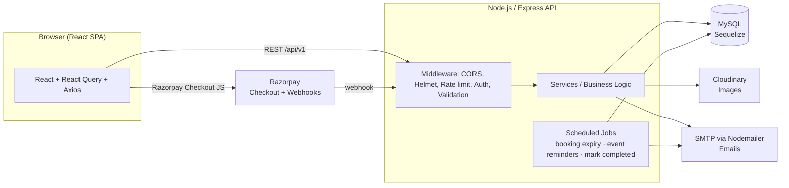
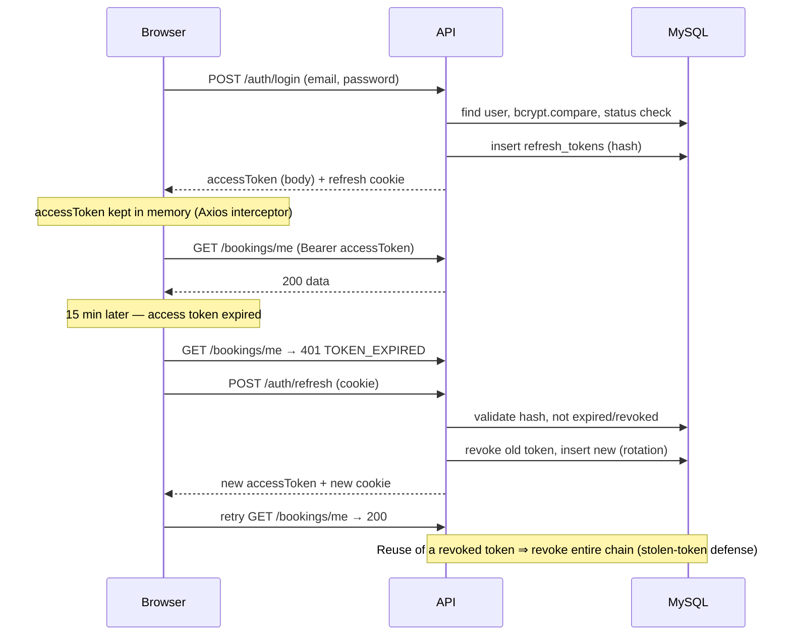
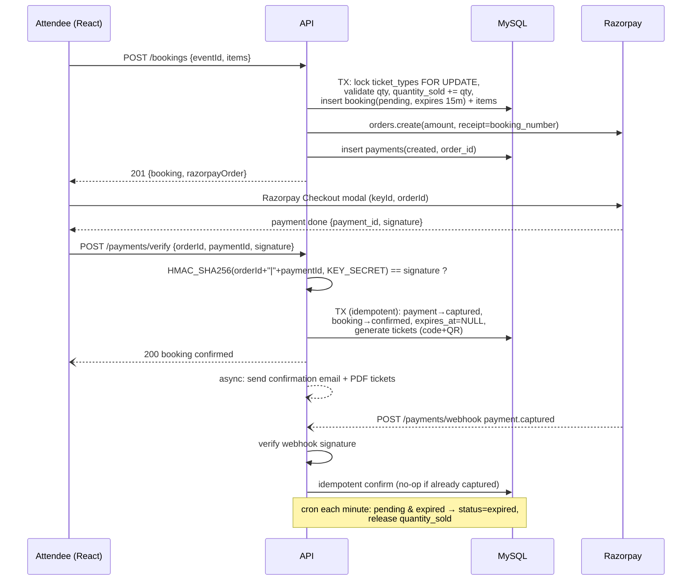
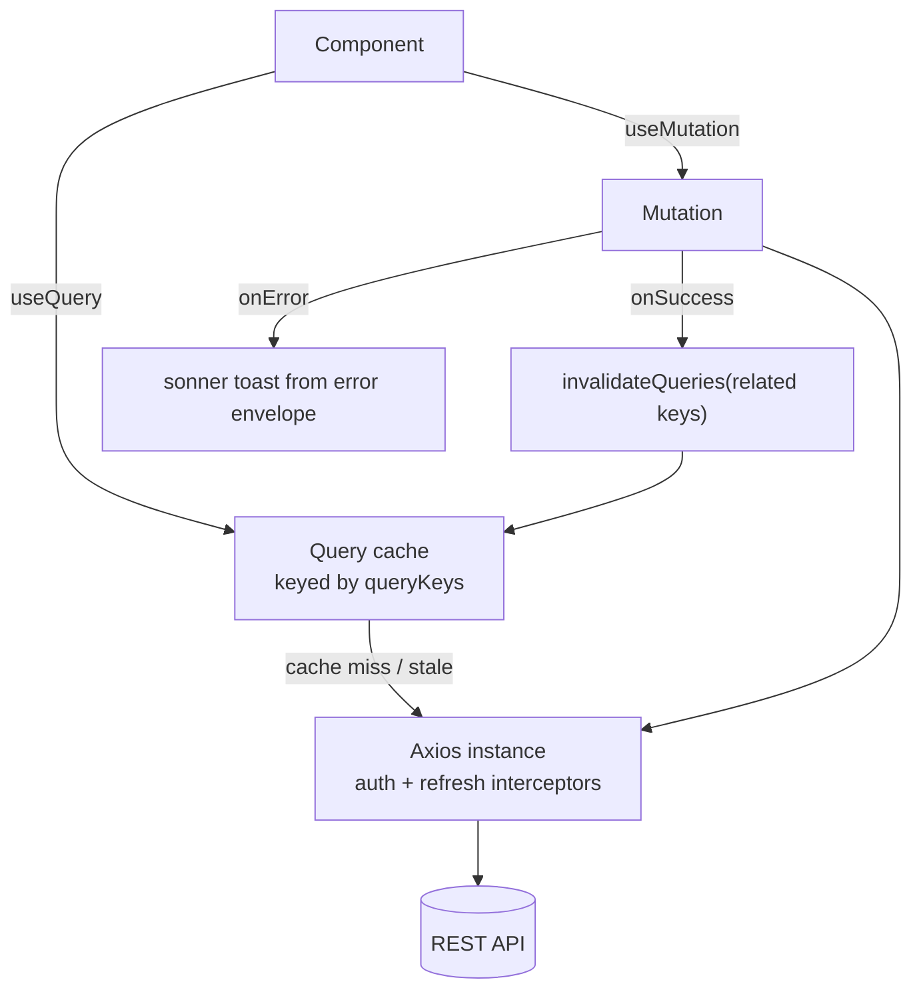

# 05 — Application Architecture

## 1. System Context



Key properties:

- **Stateless API** — all session state lives in JWTs + the `refresh_tokens` table; horizontal scaling is trivial.
- **Layered backend** — `routes → controllers → services → models`; business rules live only in services (see [07](07-backend-plan.md)).
- **SPA frontend** — React Router for navigation, React Query as the server-state layer (see [06](06-frontend-plan.md)).
- **Jobs** — `node-cron` in-process for MVP: expire pending bookings (every minute), send 24 h event reminders (hourly), mark past events `completed` (hourly).

## 2. Authentication Flow (JWT + Refresh Rotation)

Access token: 15 min, in memory only (never localStorage). Refresh token: 7 days, httpOnly + Secure + SameSite=Strict cookie scoped to `/api/v1/auth`, hashed at rest, **rotated on every use**.



Frontend implementation: a single Axios response interceptor catches 401 `TOKEN_EXPIRED`, queues concurrent requests, performs one refresh, then replays the queue; on refresh failure it clears auth state and redirects to `/login`.

## 3. Booking + Payment Sequence



Failure paths:

- **User abandons checkout** → booking expires via cron, inventory released, UI shows `expired` status.
- **Verify never arrives but webhook does** → webhook confirms; UI picks it up via query refetch on the booking page.
- **Signature mismatch** → 422, payment marked `failed`, booking stays `pending` until expiry.

## 4. React Query Data Flow

React Query owns **all server state**; no server data is copied into local state (Context only for auth session + theme).



**Query key factory** (single source of truth, `src/lib/query-keys.ts`):

```ts
export const qk = {
  events:   { list: (f: EventFilters) => ['events', 'list', f] as const,
              detail: (slug: string) => ['events', 'detail', slug] as const },
  myEvents: (f?: Filters) => ['organizer', 'events', f] as const,
  bookings: { mine: (f?: Filters) => ['bookings', 'me', f] as const,
              detail: (id: number) => ['bookings', id] as const },
  dashboard: (role: Role, range: string) => ['dashboard', role, range] as const,
  categories: ['categories'] as const,
  venues: (f?: Filters) => ['venues', f] as const,
  me: ['auth', 'me'] as const,
};
```

**Invalidation map** (mutation → keys invalidated):

| Mutation | Invalidates |
|---|---|
| create/update/submit/cancel event | `['organizer','events']`, `['events']`, `['dashboard']` |
| approve/reject event (admin) | `['admin','events']`, `['events']` |
| create booking / verify payment | `['bookings']`, `['events','detail', slug]` (availability), `['dashboard']` |
| check-in | `['events', id, 'attendance']` |
| category/venue CRUD | `['categories']` / `['venues']`, `['events']` |
| profile update | `['auth','me']` |

Defaults: `staleTime: 60_000` for catalog queries, `30_000` for dashboards; `retry: 1`; list queries use `placeholderData: keepPreviousData` for smooth pagination. Booking detail page polls (`refetchInterval: 3000`) while status is `pending` so webhook-confirmed payments appear without user action.

## 5. Cross-Cutting Concerns

| Concern | Approach |
|---|---|
| Validation | Zod schemas: frontend (React Hook Form resolver) + backend (`validate(schema)` middleware). Shared shapes documented in [06 §5](06-frontend-plan.md) |
| Error handling | Backend: `AppError(status, code, message)` + centralized handler → envelope. Frontend: interceptor maps envelope → toast; React Query error boundaries for page-level failures |
| Loading states | Route-level suspense skeletons + button-level pending states from `useMutation` |
| Config | `.env` on both sides; no secrets in the frontend bundle (only `VITE_API_URL`, `VITE_RAZORPAY_KEY_ID`) |
| Time | API speaks ISO-8601 UTC; UI formats with `Intl.DateTimeFormat` in the browser locale |
| Files | Images upload through the API to Cloudinary (server holds the secret); responses return CDN URLs |
