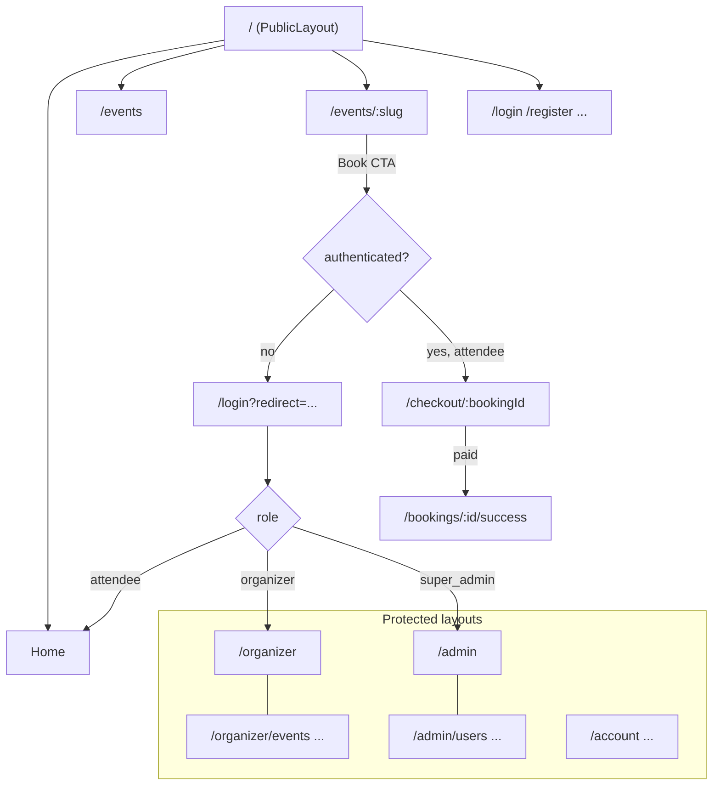

# 06 — Frontend Plan (React + TypeScript)

Vite + React + TypeScript (strict). Styling: Tailwind CSS + shadcn/ui (dark theme default). Server state: TanStack React Query. Forms: React Hook Form + Zod. Charts: Recharts. Toasts: sonner. Icons: Lucide. Animation: Framer Motion.

## 1. Folder Structure (feature-based)

```
frontend/
├── index.html
├── vite.config.ts
├── tailwind.config.ts
├── .env.example                  # VITE_API_URL, VITE_RAZORPAY_KEY_ID
└── src/
    ├── main.tsx                  # providers: QueryClientProvider, AuthProvider, ThemeProvider, Toaster
    ├── App.tsx                   # RouterProvider
    ├── routes/
    │   ├── router.tsx            # createBrowserRouter — full route map (§3)
    │   ├── ProtectedRoute.tsx    # requires auth; optional roles prop
    │   └── RoleLayouts.tsx       # AdminLayout / OrganizerLayout / AttendeeLayout guards
    ├── components/
    │   ├── ui/                   # shadcn/ui generated components (button, card, dialog, table, ...)
    │   └── shared/               # DataTable, StatCard, PageHeader, EmptyState, ConfirmDialog,
    │                             # ImageUploader, SearchInput, Pagination, StatusBadge, ChartCard, QrScanner
    ├── layouts/
    │   ├── PublicLayout.tsx      # navbar + footer
    │   └── DashboardLayout.tsx   # sidebar + topbar shell, role-aware nav items
    ├── features/
    │   ├── auth/                 # api/ hooks/ components/ pages/ schemas.ts
    │   ├── events/               # public catalog + detail
    │   ├── organizer-events/     # CRUD, submit, ticket types
    │   ├── bookings/             # checkout, history, detail, tickets
    │   ├── payments/             # razorpay.ts (checkout helper), verify hook
    │   ├── attendance/           # check-in scanner, manual check-in, reports
    │   ├── admin/                # users, organizers, categories, venues, approvals, bookings monitor
    │   ├── dashboard/            # role dashboards + charts
    │   ├── reports/              # report views + CSV download
    │   ├── notifications/        # [Phase 2]
    │   ├── reviews/              # [Phase 2]
    │   └── wishlist/             # [Phase 2]
    ├── lib/
    │   ├── axios.ts              # instance + auth/refresh interceptors
    │   ├── query-client.ts       # defaults (staleTime, retry)
    │   ├── query-keys.ts         # qk factory (05 §4)
    │   ├── format.ts             # paise→₹, UTC→local date, etc.
    │   └── utils.ts              # cn(), misc
    ├── hooks/                    # useDebounce, useAuth, usePagination
    ├── context/                  # AuthContext (user, accessToken in memory), ThemeContext
    └── types/                    # api.ts (envelope, entities), enums.ts
```

Each `features/<name>/` owns its `api/` (Axios calls), `hooks/` (useQuery/useMutation wrappers), `components/`, `pages/`, and `schemas.ts` (Zod). Cross-feature imports go through `components/shared` or `lib` only.

## 2. UI Page List

### Public (guest)
| Page | Route | Notes |
|---|---|---|
| Home / Landing | `/` | Hero, featured events, categories strip |
| Browse Events | `/events` | Filter sidebar (category, city, date, price), search, sort, paginated grid |
| Event Details | `/events/:slug` | Banner, gallery, schedule, venue map link, ticket types + availability, Book CTA |
| Login | `/login` · Register | `/register` | Attendee/organizer toggle on register |
| Verify Email | `/verify-email` | Token from link |
| Forgot / Reset Password | `/forgot-password` · `/reset-password` | |
| 404 / Error | `*` | |

### Attendee (`/account/...`)
| Page | Route | Notes |
|---|---|---|
| Dashboard | `/account` | Upcoming bookings, stats |
| Checkout | `/checkout/:bookingId` | Order summary, Razorpay modal, expiry countdown (15 min hold) |
| Booking Success | `/bookings/:id/success` | Confirmation + tickets |
| My Bookings | `/account/bookings` | History with status badges |
| Booking Detail | `/account/bookings/:id` | Items, tickets w/ QR, download PDF, cancel |
| Profile | `/account/profile` | Name, avatar, phone, change password |
| Wishlist [P2] | `/account/wishlist` | |
| Notifications [P2] | `/account/notifications` | |

### Organizer (`/organizer/...`)
| Page | Route | Notes |
|---|---|---|
| Dashboard | `/organizer` | Revenue chart, tickets sold, attendance rate, upcoming events |
| My Events | `/organizer/events` | Table w/ status filter, lifecycle actions |
| Create / Edit Event | `/organizer/events/new` · `/organizer/events/:id/edit` | Multi-step form: details → schedule/venue → media → ticket types → review & submit |
| Event Bookings | `/organizer/events/:id/bookings` | Per-event booking table |
| Attendance / Check-in | `/organizer/events/:id/attendance` | QR scanner (camera), manual check-in, live checked-in count |
| Revenue | `/organizer/revenue` | Revenue dashboard + per-event breakdown |
| Reports | `/organizer/reports` | CSV export |
| Organizer Profile | `/organizer/profile` | Org details; shows approval status banner if pending/rejected |
| Team Members [P2] | `/organizer/team` | |

### Super Admin (`/admin/...`)
| Page | Route | Notes |
|---|---|---|
| Dashboard | `/admin` | Platform totals, revenue series, bookings by category, recent activity |
| Users | `/admin/users` (+ `/:id`) | Table, search/filter, suspend/activate |
| Organizers | `/admin/organizers` (+ `/:id`) | Approval queue + all organizers |
| Categories | `/admin/categories` | CRUD w/ image upload, active toggle |
| Venues | `/admin/venues` (+ new/edit) | CRUD w/ map coords, facilities |
| Event Approvals | `/admin/events?status=pending_approval` | Review detail drawer, approve/reject w/ reason |
| All Events | `/admin/events` | Any status, feature toggle |
| Bookings Monitor | `/admin/bookings` | Global table w/ filters |
| Payments | `/admin/payments` | Transactions, refund action |
| Reports | `/admin/reports` | Revenue, bookings, attendance, growth, performance; CSV |
| Settings [P2] | `/admin/settings` · Audit Logs [P2] `/admin/audit-logs` | |

## 3. Routing & Navigation Flow



Rules:

- `ProtectedRoute` checks auth; role layouts check role → unauthorized users are redirected to their own home (never a blank 403 page).
- After login, redirect to `?redirect=` target or role home (`attendee → /`, `organizer → /organizer`, `super_admin → /admin`).
- Unverified attendees hitting Book get an inline "verify your email" prompt with resend action.
- Sidebar nav items are generated from a role-keyed config so nav and routes never drift.

## 4. Key UX States

Every data screen implements: skeleton loading, empty state (with CTA), error state (retry), and pagination. Mutations show button spinners and sonner toasts sourced from the API envelope `message`. Checkout page shows a live countdown to booking expiry; on expiry it disables payment and offers "start over".

## 5. Validation Rules (Zod)

Mirrored on the backend (see [07 §4](07-backend-plan.md)). Central rules:

| Field | Rule |
|---|---|
| name | string, 2–100 chars |
| email | valid email, lowercased |
| password | ≥ 8 chars, ≥1 uppercase, ≥1 digit; confirm must match |
| phone | optional, 10 digits (India) |
| organizationName | 2–150 chars (organizer register) |
| event title | 5–200 chars |
| event description | 20–10,000 chars |
| startTime / endTime | future date; `endTime > startTime` |
| registrationDeadline | `≤ startTime` |
| capacity | int ≥ 1, ≤ selected venue capacity |
| ticket price | int paise ≥ 0 (0 = free) |
| ticket quantity | int ≥ 1; sum across types ≤ event capacity |
| booking quantity | 1 ≤ qty ≤ ticketType.maxPerBooking |
| rating [P2] | int 1–5 |
| image upload | jpeg/png/webp, ≤ 2 MB |

Form-level: multi-step event form validates per step (`trigger()`) and blocks submit-for-approval until ≥1 active ticket type exists.
