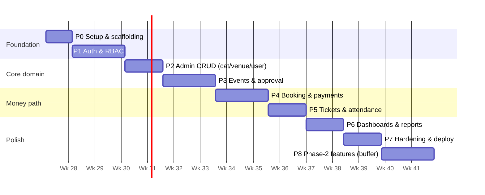

# 09 — Development Roadmap

Sized for a solo developer alongside coursework: ~14–16 weeks of part-time work. Each phase ends with working, demonstrable software — if the schedule slips, everything through Phase 6 is still a complete, defensible project.

## Phase 0 — Setup & Scaffolding (Week 1)

Monorepo-style folder (`frontend/`, `backend/`), Vite + React + TS + Tailwind + shadcn/ui with dark theme; Express + TS skeleton per [07](07-backend-plan.md); MySQL + Sequelize + first migration; ESLint/Prettier; `.env.example` both sides; git repo initialized.

**Accept:** `pnpm dev` runs both apps; `GET /api/v1/health` returns the envelope; dark-themed landing shell renders.

## Phase 1 — Authentication & RBAC (Weeks 2–3)

All `/auth` endpoints incl. email verification and reset; refresh rotation with reuse detection; `authenticate`/`authorize`/`validate` middleware; seeded super admin; frontend auth pages, AuthContext, Axios interceptors, protected role layouts.

**Accept:** register→verify→login→refresh→logout works end-to-end; suspended user is locked out; role redirects correct; auth rate limit fires.

## Phase 2 — Admin CRUD: Users, Categories, Venues, Organizer Approval (Weeks 4–5)

Admin sidebar + DataTable pattern (search/sort/filter/paginate) built once, reused everywhere; categories & venues CRUD with Cloudinary upload; user management; organizer application + approval queue with emails.

**Accept:** admin can fully manage categories/venues/users; a new organizer registers, gets approved, and gains organizer access.

## Phase 3 — Event Management & Approval (Weeks 6–7)

Event model + lifecycle state machine; multi-step create/edit form (details → schedule/venue → media → tickets → review); ticket types CRUD with guards; submit/approve/reject with reason + emails; public catalog with full-text search, filters, event detail page.

**Accept:** organizer drafts → submits; admin approves → event is publicly visible, searchable, and shows live ticket availability; rejected events show the reason to the organizer.

## Phase 4 — Booking & Payments (Weeks 8–9) ⚠ highest-risk phase

Locked-transaction booking creation with 15-min hold + expiry cron; Razorpay order + Checkout modal; `/payments/verify` + webhook (both idempotent); confirmation email; booking history/detail; checkout page with countdown.

**Accept:** end-to-end test-mode purchase confirms a booking; two parallel bookings of the last ticket → exactly one succeeds; abandoned checkout releases inventory within a minute; replayed webhook is a no-op.

## Phase 5 — Tickets & Attendance (Weeks 10–11)

Ticket generation with signed QR; PDF download (pdfkit); check-in endpoint with constant-time HMAC verify + single-use transition; organizer scanner UI (camera via `html5-qrcode` or manual paste) + manual check-in; attendance stats per event.

**Accept:** a purchased ticket's QR checks in exactly once; the second scan shows `ALREADY_CHECKED_IN`; forged payloads rejected; attendance rate visible to organizer.

## Phase 6 — Dashboards & Reports (Weeks 12–13)

Three role dashboards (Recharts: revenue series, bookings by category, sell-through); dashboard endpoints with range filter; CSV report exports; event reminder cron (T-24 h) and auto-complete cron.

**Accept:** each role logs in to a populated dashboard; CSV downloads open in Excel/Sheets; reminder email arrives for a T-24 h event.

## Phase 7 — Hardening, Polish & Deployment (Weeks 14–15)

Security pass against [08](08-security.md) checklist; empty/loading/error states audit; mobile responsiveness pass; Framer Motion polish; seed demo data; deploy per [10](10-deployment-future.md); README + screenshots; project report/viva material.

**Accept:** deployed URLs work end-to-end incl. a live test payment and webhook; Lighthouse mobile score ≥ 85; demo script rehearsed.

## Phase 8 — Phase-2 Features (buffer, as time allows)

Priority order: 1) Reviews & ratings 2) Wishlist 3) In-app notification center 4) PDF report export 5) Audit logs 6) Organizer team members 7) Seat selection. Each is independently shippable; schema and API stubs already exist.

## Working Practices

- One feature branch per phase item; merge to `main` only green (`tsc --noEmit`, lint, manual smoke test).
- Commit migrations with the feature that needs them; never edit an applied migration.
- Keep a `DEMO.md` script updated each phase — the viva demo is a deliverable, not an afterthought.
- Test focus (time-boxed): unit tests for `booking.service` (inventory math, expiry) and `payment.service` (signature, idempotency) — the two places bugs are catastrophic; elsewhere rely on manual smoke testing.
